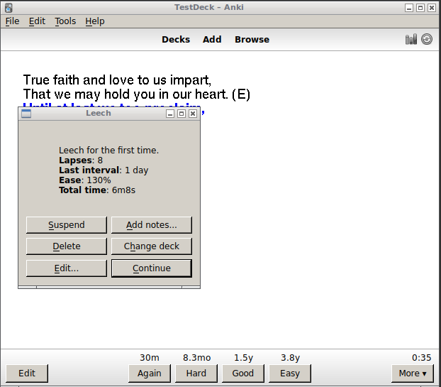

# Leech Dialog – Anki add-on

This is an add-on to [Anki](http://ankisrs.net) to make it easy to deal with [leeches](http://ankisrs.net/docs/manual.html#leeches) as soon as they occur. It somewhat imitates [SuperMemo](http://www.supermemo.com)’s “[leech wizard](https://www.supermemo.com/help/leech.htm#Leech_alert_wizard),” though as with all features of SuperMemo in Anki, the Anki version is somewhat less complicated!

While Anki notifies you of and tags and suspends leeches as soon as it detects them, the default behavior requires you to carry out periodic maintenance on your deck by looking for cards that have been marked as leeches and dealing with them. If you prefer a more proactive approach where you deal with leeches as soon as they occur, this add-on is for you.

## Installation
This add-on can be downloaded from its [AnkiWeb page](https://ankiweb.net/shared/info/359861680).

You will also want to **turn off automatic leech suspension** in all of your deck options groups if it’s currently on – otherwise leeches will both get suspended *and* have whatever option you choose in the dialog applied, which is probably not what you want. The option to change is *Leech action* in the Lapses tab; you should set it to “Tag only.”

## Use
A dialog with six options will be presented whenever a leech is encountered, right after you press Again:

At the top a few data points about the card are presented to help you make your decision:

* *Number of leech warnings*: This will either say “leech for the first time” or note the number of times the card has been flagged as a leech. Anki considers a card a leech for the first time when it reaches 8 lapses or the *leech threshold* set in the options. Subsequently it will be flagged as a leech again anytime it reaches half that threshold (with the default settings, at 12, 16, 20, and so on).
* *Lapses*: The raw number of times you have failed this card in review. This does *not* count times you failed the card while it was in learning or relearning.
* *Last interval*: The interval that the card was at on this review (i.e., just before you failed it).
* *Ease*: The [ease](http://ankisrs.net/docs/manual.html#what-spaced-repetition-algorithm-does-anki-use) of the card; this will usually be close to 130% for a leech, as it decreases by 20% from the default start value of 250% on each fail, down to a minimum of 130%, and increases only when Easy is selected. A higher value suggests that the card is probably recovering from being a leech (because you pressed easy a couple of times).
* *Total time*: The total amount of time you’ve spent studying this card (in both review and learning/relearning mode). This will often be shockingly high, and serves as good motivation to deal with the leech now instead of putting it off again!

Underneath are six options for handling the leech:

* *Suspend*: Suspend this card. Some leeches are caused by interference with other cards you’re currently studying, so waiting and then reintroducing the card a month or two later might actually solve the problem. You might also choose this option if you’re not sure what to do with the card right now and would prefer to deal with it later. All leeches found with this add-on will be tagged ‘leech_dialog’, so you can find cards you’ve suspended later with the search `is:suspended tag:leech_dialog`.
* *Delete*: Delete this card’s note from your collection. (You will be warned if this note has several cards and you would be deleting the others as well; if this applies, you may wish to suspend the card or move it into an “unused” deck instead.) Deleting difficult cards may seem silly at first, but if you are studying a high volume of loosely connected material (e.g., vocabulary words or sentences) and this card isn’t particularly important, deleting may easily be the best choice. Leeches take up large amounts of study time, and your study will be more enjoyable if you can get rid of the frustrating cards. SuperMemo’s [theory](https://www.supermemo.com/articles/theory.htm) page suggests that removing the most difficult 10% of your material can improve your learning efficiency by up to 300%!
* *Edit...*: Open the editor to modify this card. Some leeches occur because the question is worded poorly, and improving it may resolve the problem. When you are finished editing, you can click the “continue” button to place it back in the relearn queue.
* *Add notes...*: Open the add notes dialog. If this card is difficult because it contains several pieces of information or is asked in an unnecessarily difficult way, you may be able to fix the problem by splitting it into several cards. See [twenty rules of formulating knowledge](https://www.supermemo.com/en/articles/20rules) for more information.
* *Change deck*: Move this card into a different deck (without suspending or otherwise modifying it). You may wish to put difficult cards into a different deck for extra study or to keep them aside temporarily.
* *Continue*: Proceed with reviews, placing the card in the relearning queue as a lapse as usual. This option is appropriate after editing a card. If you think you have finally learned the card and just need a little while longer to get the hang of it, it may also be appropriate to choose this option without modifying the card at all. Be very careful about doing this, however – getting into the habit of choosing this option on too many leeches can severely decrease your study efficiency. If a card is important and you can’t afford to delete it, you should strongly prefer to edit/reformulate or temporarily suspend it over just pressing continue, especially if the card has already been flagged as a leech several times. If you do choose to press continue, you should at least take a moment to make up a mnemonic to make the card easier to remember.

Occasionally you may want to take some other action, like opening the browser to review some similar notes in your collection, or rating the card differently. In this case, choose *Continue* (or press Escape), then undo the review (Ctrl-Z / Command-Z), and proceed from there.

Note that if you take some action in the leech dialog (such as editing or suspending the card) and then choose undo, both the edit and the review will be undone. This is probably what you want, but it may be unexpected.

A brief summary of the possible reasons for choosing each option, as presented above, can be displayed in the dialog by hovering your mouse over the button.

## Interaction with mobile & `leech` tags
As with most other add-ons, this add-on does not function on AnkiWeb or mobile devices. Even if it could, it might not always be convenient to deal with leeches at the time on a small screen. For this reason, if you study on such devices, you will periodically want to check through the leeches that were marked on that device. By default, Anki tags all notes it marks as leeches `leech`. So that you can separate leeches that were marked while you were using this add-on (and probably don’t need further work) from leeches that were marked without this add-on (which you probably haven’t dealt with yet), leeches detected on devices with this add-on are instead tagged `leech_dialog` and are *not* tagged `leech`.

In short, searching for `tag:leech` should find the notes that need work, not ones that you’ve already considered.
